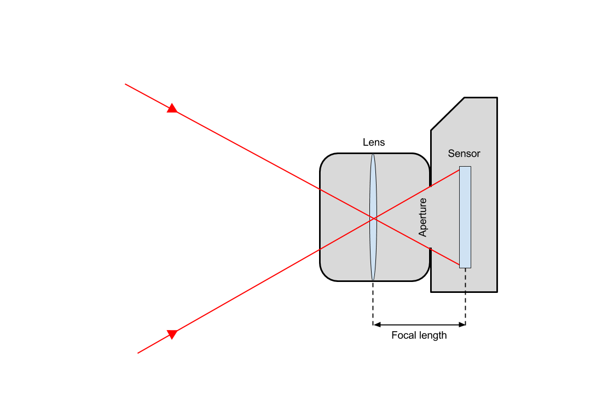
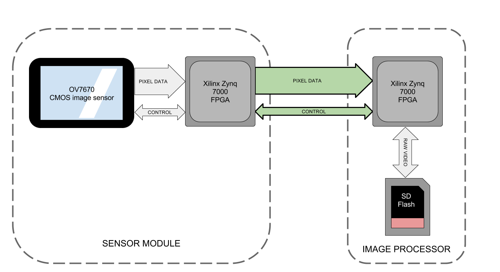
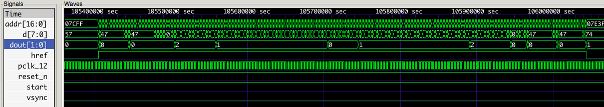
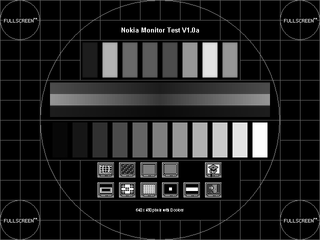
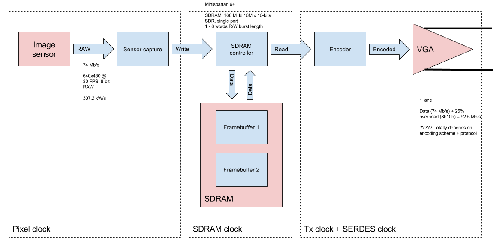

# Table of Contents

- Introduction
    + A brief history of camera technology
    + Motivation
    + Pre-requisite concepts
        * CCD and CMOS sensor technologies
        * High-speed data transmission
    + Project testing platform
        * Introduction to test system architecture
        * Test system specification
- High-speed serial interfaces
    + Signal integrity
    + SERDES
    + Line coding
- High-definition multimedia interface
    + Introduction
    + Modifications
- Sensor controllers
    + OV7670
- Testing
    + Signal integrity
    + Electromagnetic interference
    + Bit error rate and image integrity
    + Optical and sensor performance
- Case study
- Future work
- Conclusion

# Introduction

Modern cameras – both still-motion and video – feature a high level of upgradeability: lenses, filters and other accessories are all interchangeable, permitting finer control. As one of the most important components of the system, the image sensor plays a vital role in the composure of the final image. It dictates not only the output resolution, but also light sensitivity, colour representation, frame-rate and crop-factor. In spite of its significance, only a handful of expensive cinema and medium-format cameras include interchangeable sensors; even then, these components are proprietary. Upgrading the sensor in a mainstream camera requires the purchase of an entirely new system.

This paper details an FPGA-based sensor-agnostic interface which can be used to connect any image sensor to any image processor, thus providing the basis for a truly modular and upgradeable camera system.

## A brief history of camera technology

Modern cameras can trace their humble beginnings back to the camera obscura first described by ancient Chinese philosopher Mozi, who discovered an optical trick to pass light from an external scene through a hole and project it on a surface.[1] In around 1816, French inventor Nicéphore Niépce managed to capture the first camera images using paper treated with silver chloride.[2] Continuing his work, Niépce's partner Louis Daguerre developed the first conventional camera using a simple lens to focus light onto a silver-coated copper plate.[3]

[Figure x] illustrates a very basic camera. Light from an external scene is focused by a lens and passed through an aperture hole where it is inversely projected onto a photosensitive surface for capture. The focal length dictates the distance between the optical centre of the lens and the sensor when the lens is focused to infinity.[4] A shutter mechanism behind the aperture is used to control how much light hits the surface of the sensor, thus exposing the image. There are multiple ways to increase image exposure: expanding the aperture, holding the shutter open for longer, or increasing the ISO sensitivity of the sensor. Inversely, narrower apertures, shorter exposure times and lower sensitivities all decease the amount of light that hits the sensor, resulting in a darker image. 

Following the invention of the first transistor at Bell Laboratories in 1947, electronic devices could be dramatically reduced in size through the use of integrated circuits, paving the way for the start of the digital era.[5] The first self-contained digital camera was developed by Steve Sasson of Eastman Kodak in 1975. Instead of using film, Sasson focused the light onto a state-of-the-art digital image sensor based on the first charge-coupled device (CCD) invented by Bell Laboratories scientists Willard Boyce and George Smith), the output of which was saved to a tape cassette for later viewing on a TV.[6][7]

Today, there are many different camera formats available – one of the key differentiators being the area of the image sensor. A larger sensor can capture more light and thus the dynamic range is greatly increased, resulting in higher image quality.[8] This is true of both digital sensors, and their film counterparts. 

## Motivation

Professional camera systems are second-to-none when it comes to image quality and usability. The camera accessories market in Western Europe and the USA was worth $1.7bn in 2006, a market which owed its existence to the modularity of modern cameras. With $270 of accessories bought per Digital Single Lens Reflex (DSLR) camera on average, customisability is clearly an important feature.[9] Despite this, cameras lack customisability in one key area: IO expansion. Audio, video and storage interfaces are usually a fixed function of the camera's motherboard, and therefore non-interchangeable – users must pre-empt their requirements in order to 'futureproof' their purchase. Inevitably these performance limits will be met; if a user wishes to step beyond these limits then an entirely new camera must be purchased. While some parts will undoubtedly be at the cutting edge of technology and require semi-frequent upgrades, other parts (camera bodies, audio amplifiers) may be technologically more mature and adhere to longer progression time-scales; thus it seems wasteful and costly to re-purchase these parts when buying a new camera system.

It is not the intent of this paper however, to suggest that the concept of an interchangeable camera sensor is entirely original – a few high-end medium / large format cameras – designed by Hasselblad, Phase One and Mayima – exist which support interchangeable 'sensor backs' , however the interfaces are proprietary, thus limiting the user to a small handful of first-party options. Additionally, the prohibitively high price (upwards of $10,000 at the time of writing) puts them far out of reach for the average professional photographer. Rather, the motivation of this project is to design an open standard for interchangeable sensors which can be freely implemented by anyone. In doing so, the basis for a truly modular and upgradable camera system is provided, with a broad range of applications including cinema, photography and computer vision. While idealistic, an open standard would benefit consumers by enabling new companies to gain a foothold serving smaller, more specialised markets which are too niche for established companies such as Nikon and Canon. Ultimately, this project aims to improve the camera selection available to consumers in the future by improving expandability options and fostering openness.

## Pre-requisite concepts

### CCD and CMOS sensor technologies

The sensors themselves fall into one of two categories depending on technology used: Charge-coupled Devices (CCD) and Complementary Metal-Oxide Semiconductors (CMOS). While both use an array of photosites to collect charge from incident photons during exposure time, the readout and analogue-to-digital conversion process differs for each. During readout time, CCDs sequentially shift the accumulated charges into horizontal and vertical readout registers where they are transferred to a chip-level output amplifier and analogue-to-digital converter to generate a binary bitstream. CCD image sensors are capable of very low noise and high sensitivity due to the use optimised photosites; this made them a very popular choice for applications demanding high image quality.

Unlike CCDs, which rely on a very specialised fabrication process, CMOS sensors can be manufactured using traditional CMOS processes, benefiting greatly from the associated economies of scale. Active Pixel Sensors (APS), the most common form of CMOS sensor, differ from CCDs in that each photosite contains a dedicated amplifier, meaning that the light-induced voltages can be driven directly to the row and column decoders for digitisation. Because of the CMOS fabrication process, other camera functions can also be integrated onto the same chip, cutting both the cost and size of the device.[10]  This level of integration, and the faster speeds of parallel readout processing have meant that CMOS sensors have seen a recent surge in popularity, and are forecast to account for 85% of the total image sensor market in 2017.[11]

Photosites can only measure light intensity, not wavelength, producing greyscale images. By placing a coloured filter in front of each photosite, it is possible to only let light of a certain wavelength through.[12] Given the fixed pattern of the colour filter array (CFA), it is possible to generate a full-colour image using a demosaicing algorithm, the simplest of which is bilinear interpolation, to calculate the red, green and blue intensities for each pixel. One such CFA, the Bayer filter, contains twice as many green elements as red and blue to mimic the physiology of the human eye, as illustrated in [figure x].[13]

### High-speed data transmission

While sensors can capture both still images and video, this project mainly concerns the latter due to its resource-intensive nature. A recent study found that 75% of households in the United States had a high-definition television.[14] The popularity of HD content makes it important to consider how bandwidth requirements increase with larger resolutions. An uncompressed 24-bit colour 1080p video at 24fps has a bitrate of almost 1.2 Gbps, as calculated in [equation x], well within the range where signal integrity becomes important.

When transmitting a high-frequency signal between two devices, close attention must be paid to many aspects of the design to ensure that the signal integrity is preserved. The basic premise of signal integrity is covered here, however [section x] will cover the issue in greater depth. With low-frequency signals, a wire or PCB trace can be modelled as an ideal circuit, without resistance, capacitance or inductance. As the frequency increases however, so-called transmission line effects are prominent and the AC characteristics of the wire become very important. If there is a mismatch between the source, line and receiver impedances then the transmitted signal will not be fully absorbed at the load, resulting in any excess energy rebounding between source and receiver repeatedly until it has been fully absorbed. Due to superposition, the reflected waves will cause ringing and other signal integrity issues that reduce signal quality. If the issue is severe enough, the receiver cannot correctly interpret the signal and bit errors will occur. Parallel wires can also cause mutual inductance problems whereby the magnetic field generated by current travelling through one wire, will induce a current in the adjacent wire. Similarly, mutual capacitance is caused by the coupling of the two electric fields. These issues can be mitigated by taking care to ensure that impedance is properly controlled and PCB traces are placed with care when designing circuits.[15]

[Table x] shows a list of existing protocols / interfaces for transmitting image data. 

Name            Parent      Family      Bandwidth   Scheme      Complexity 
USB3 Vision     USB 3       USB         2.8 Gbps    Serial      High
GigE Vision     IP/UDP      Ethernet    800 Mbps    Serial      Medium    
Camera Link     N/A         Camera Link 6.8 Gbps    Serial      Medium
MIPI CSI-3      M-PHY       MIPI        23.2 Gbps   Serial      Medium
HDMI 2.0        N/A         HDMI        18 Gbps     Serial      Low / Medium 

[16][17][18]

## Project testing platform

The design of a full camera system is beyond the scope of this project, however an image sensor produced by OmniVision is used to capture real-world image data, providing a realistic test environment. FPGAs are used extensively to set up a reconfigurable interface between the sensor and processor sides of the link, as well as generate test patterns for synthetic throughput and reliability tests. Given the main requirement of a sensor-agnostic interface is to work with a large range of sensors, there is a heavy emphasis on evaluating the system performance across several key metrics:

- Reliability – preserving signal integrity and ensuring low bit error rates for a stable and trustworthy system.
- Scalability – transferring data across a wide range of resolutions and framerates to maintain a high level of expandability.
- Maximum throughput – ensuring that the sensor interface does not bottleneck the system.

### Introduction to test system architecture

The test system detailed in [figure x] makes extensive use of field-programmable-gate-arrays (FPGAs) and is mainly based around the Zynq platform from Xilinx – a programmable system-on-chip (SoC) with an embedded ARM core. FPGAs are used instead of microcontrollers for several reasons, primarily because of the far greater flexibility of programmable logic, but also due to the high number of IO pins and throughput capabilities required to interface with high-resolution image sensors. FPGAs are massively parallel and contain reconfigurable logic as well as multi-gigabit transceivers. Microcontrollers on the other hand, rely on fixed peripherals for a limited range of interface support; those which are not supported by the built-in peripherals must utilise bit-banging – the process of using software to control the timing, synchronisation and state of IO ports to transmit or receive data. Microcontrollers simply lack the horsepower and resources to bit-bang a custom high-speed serial interface. 

The system in [figure x] consists of an OmniVision OV7670 image sensor connected to a set of parallel inputs on a Xilinx Zynq 7000 FPGA acting as sensor controller. Pixel data is pulled from the sensor by the controller and placed into a RAM framebuffer where it can be retrieved by another part of the controller and transmitted across the interface. Optionally the controller can also generate a custom test pattern to be transmitted instead of the real sensor output for the purpose of system testing and benchmarking across a range of resolutions and framerates. These two components form the *sensor module*, which is designed to be interchangeable with other sensor-controller pairs. The design of the interface highlighted in bold forms the main part of this project. 

On the master side of the interface is a second Zynq 7000 FPGA acting as the host controller. Pixel data going over the interface is received and decoded by the host before being stored in a framebuffer in RAM. The embedded ARM core inside the host forms the processing system, which takes each from from RAM and serialises it into a RAW video stream in flash memory for playback on a computer. These components form the *image processor*, which is capable of communicating with any connected *sensor module*.

### Test system specification

Resolution: 320x240 (QVGA) - 2048x1080 (DCI 2K)
Framerate: 24 FPS - 60 FPS
Pixel depth: 8 bits
Maximum throughput: 1.2 Gbps
Output format: SD card

The specifications in [table x] were decided after surveying best-selling cameras across several markets, consisting of cinema cameras, single-lens-reflex cameras (DSLRs) and computer-vision / industrial cameras This survey is visualised in [appendix figure x].

# Bibliography

1. http://www.sennhs.org/ourpages/auto/2013/4/1/41446028/The%20Birth%20of%20Cameras.pdf
2. Stokstad, Marilyn; David Cateforis; Stephen Addiss (2005). Art History (Second ed.). Upper Saddle River, New Jersey: Pearson Education. p. 964. ISBN 0-13-145527-3.
3. http://preserve.harvard.edu/daguerreotypes
4. http://martybugs.net/blog/blog.cgi/learning/Field-Of-View-And-More.html
5. http://www.computerhistory.org/semiconductor/timeline/1947-invention.html
6. http://www.nobelprize.org/nobel_prizes/physics/laureates/2009/popular-physicsprize2009.pdf
7. https://web.archive.org/web/20130121194248/http://pluggedin.kodak.com/pluggedin/post/?id=687843
8. http://white.stanford.edu/%7Ebrian/papers/pdc/pixelSize_SPIE00.pdf
9. Camera Accessories Market to top Euros 1.1bn in Western Europe by 2009, Understanding and Solutions, March 2007 - https://web.archive.org/web/20070604201557/http://www.uands.com/downloadarticle.asp?id=43
10. Ge, X., 2012. The design of a global shutter CMOS image sensor in 110nm technology (Doctoral dissertation, TU Delft, Delft University of Technology).
11. http://www.icinsights.com/data/articles/documents/526.pdf
12. http://www.google.co.uk/patents/US3971065
13. http://research.microsoft.com/pubs/102068/Demosaicing_ICASSP04.pdf
14. http://www.leichtmanresearch.com/press/020813release.pdf
15. https://www.altera.com/content/dam/altera-www/global/en_US/pdfs/literature/wp/wp_sgnlntgry.pdf
16. http://www.controlvision.co.nz/newsletters/2013/08/Basler_Interface_Comparsion.pdf
17. http://www.arrowdevices.com/blog/mipi-csi-3-a-game-changer-for-future-camera-technology/
18. http://www.hdmi.org/manufacturer/hdmi_2_0/hdmi_2_0_faq.aspx

# Summary of progress

The first milestone for the project was to build a system to capture frames from a low-resolution image sensor in order to get comfortable using FPGAs for data transfer and image processing. OmniVision's low-cost OV7670 sensor was chosen for its simple operation and the abundance of reference material available due to its popularity in the hobbyist community. The OV7670 was connected to a Xilinx Spartan-3E FPGA development board provided by the electronics lab.

Considerable effort was put into building a solid toolchain and efficient workflow before starting the design process. It was decided that investing time into setting up an automated test framework would pay off later in the time saved debugging and chasing down regressions. Much like *unit tests* are used in software development, hardware designers write *testbenches* to ensure that each aspect of the design behaves as intended. Testbenches are normally written in the same language as the design itself (usually Verilog, SystemVerilog or VHDL), however general-purpose programming in a hardware description language (HDL) is tedious and the emphasis on processing image data necessitated a higher-level language like Python. As such, the testbenches are written using the MyHDL Python library, which enables hardware designs to be written in Python and compiled to Verilog or VHDL for synthesis. Its main however, is that it can interact with the Icarus Verilog simulator used for this project. This means that testbench code can be written in Python to drive the design under test (DUT) written in Verilog. As well as simplifying testbench development, Python has the advantage of being compatible with many automated testing environments. The final setup consisted of using Verilog to design the hardware, Python, MyHDL and Nose to write testbenches / unit tests, Icarus to simulate the design and a simple Makefile to tie everything together. Additionally, Travis Continuous Integration was used to automatically test the code every time a commit was staged to the project repository on GitHub, sending a notification email if the change broke anything. [Figure x] shows the simulation output of the `ov7670_capture` module being run with Icarus, viewed in the GtkWave waveform viewer. The `d` and `href` signals correspond to a horizontal line of pixels generated by the testbench. The captured test pattern is also depicted.

Once the development workflow was finalised, the OV7670 interfacing code was designed and tested one module at a time. The objective for the first milestone being to grab a continuous stream of frames from the OV7670 sensor and display them on a VGA monitor. [Figure x] shows the overall system architecture as a collection of interconnected Verilog modules.

Initially, the intention was to pull the pixel data from the sensor and push it straight out onto the VGA port. Unfortunately the image sensor and VGA port run at different frequencies and the clocks are derived from two separate sources. When connecting two blocks with different clock frequencies or phases, one must be very careful to avoid clock domain crossing (CDC) issues which can lead to instabilities. Instead, the FPGA's internal block RAM was used to create a framebuffer to safely transfer the data across the two clock domains, however the Spartan-3E's severely limited resources required certain sacrifices to be made to image quality. While the Spartan-3E part contains 216K bits of block RAM, a 640x480 RAW image requires 2.457M bits, thus it is too large to fit inside the FPGA. To get the image to fit with the limited resources available it was necessary to reduce the resolution. A further complication was that the image scaling circuitry inside the OV7670 only supports certain resolutions in certain modes. The mode which produced RAW bayer data (instead of RGB or YUV) did not support the lowest resolution, so QVGA (320x240) resolution was used, and the bit depth was reduced to 2 bits in order to fit the image inside block RAM, further diminishing the image quality.

The OV7670 image sensor contains a set of internal registers to configure all aspects of the device's operation. In order to set the output resolution and format the FPGA had to initialise these registers using the SCCB protocol – an I2C clone. Rather than invent the wheel again, an SCCB controller written for a similar project was used to communicated with the image sensor. Using a combination of the sensor datasheet, implementation guide and various community references, the correct register values to produce a 320x240 RAW bayer image were identified. This was particularly frustrating as the official documentation contradicts itself in a few places, making it hard to determine the correct settings.

Following the successful simulation of each module, an IP block was generated for the framebuffer, and the design was imported into Xilinx's ISE tool for synthesis. After the synthesis netlist was generated, pre-routing pin constraints were added to specify how the design was to connect with the IO ports on the FPGA. The last step was to perform the place-and-route process to generate a *bitfile* which was loaded onto the device.

Currently the design is loaded onto the hardware but lacks any form of testing. The immediate next steps are to start debugging the design on hardware and fix any issues. This will lead nicely into the design of the sensor controller to host controller interface for the next part of the project.

# Revised workplan

- Pick appropriate mainboard FPGA / microprocessor combo
- Design and fabricate any interposer boards to connect sensor module (sensor + intermediary FPGA) and mainboard (acquisition FPGA + microprocessor)
- Write interface blocks for master and slave and clock data into memory
- Use test pattern generator to measure maximum interface bandwidth
- Build custom Linux kernel for microprocessor
- Access framebuffer from Linux and save to storage medium
- Write final report and presentation

# Risk assessment

...