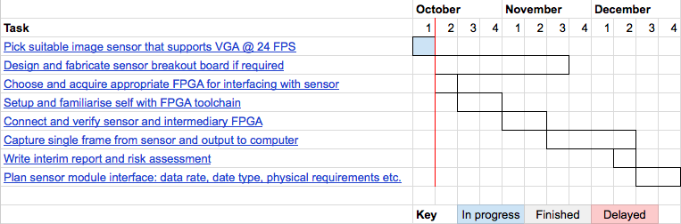

# Basics

## Project description
* Details of specific problem being addressed
* Initial analysis of user requirements and data collection methods
* Algorithms, methodologies and techniques to be employed
* Initial specfication of how users will interact with the system
* Programming languages, softrware, hardware, databases etc.
* List of background materials consulted so far including internet resources

## Workplan
* What you are going to do -> tasks and sub-tasks
* When you are going to do it -> time-periods
* Documentary requirements -> deadlines
* You can present these as you wish, e.g. a list of tasks and sub-tasks with outcomes + dates, a Gantt chart, ...
* Discuss with your supervisor about the 􏰀granularity􏰁 of the workplan e.g. very detailed, very detailed for sem A, etc.

# More details

## 1
* Your details (name, email address)
* Project title
* Supervisor's name

## 2
* Background
    - Relevant research
    - Existing systems
    - Identify a gap
* Aims
    - Overarching purpose of your project
    - Identify the design, development or research challenge that your proect aims to solve
    - Does not say **how** you will meet this challenge 

## 3
* Methodology / objectives
    - Sometimes there is more than one way of achieving your aims. Identify possible ways.
    - Choose one and justify your choise - your methodology
* Objectives should be **SMART**
    - Specific
    - Measurable
    - Achievable
    - Realistic
    - Time-limited

# 4
* Milestones
    - Often arise out of objectives
    - Developmental
    - Deliverables
* Knowledge / skills/ tools
    - Identify what you have already from your taught modules and elsewhere
    - Identify anything new you need

# 5
* Resources (hardware / software)
    - Normall expected to be those provided already by school / college
    - Can request additional resources if necessary - discuss with your supervisor
    - Can use external resources - but this is at your own risk!
* Workplan
    - GANTT chart
    
******************************************************************************

# Interchangeable Sensors for Modular Camera Systems
*Author: Michael Wild – m.a.wild@se12.qmul.ac.uk*
*Supervisor: Miles Hansard – miles.hansard@qmul.ac.uk*
*October 5th, 2015*

## Overview
The aim of this project is to design a sensor-agnostic interface which can be used to connect any image sensor to any processing board, thus providing a truly modular and upgradeable camera system.

Modern cameras (both still-motion and video) have a multitude of upgrade options: lenses, filters and other accessories are all interchangeable, enabling creative freedom and flexibility. As one of the most important components of the system, the photographic sensor plays a vital role in the final image. It dictates not only the output resolution, but also low-light performance, colour response, frame-rate and cropping. 

In spite of its significance, only a handful of niche cinema cameras include interchangeable sensors; even then, these components are not fully modular. Upgrading the sensor in a mainstream camera requires the purchase of an entirely new system.

This project seeks to provide a solid base for continued work on a fully-modular digital camera system with applications in cinema, photography and computer vision.

## Methodology

This project will be conducted in three discrete stages. Initially the focus will be on interfacing with a simple low-resolution sensor module to obtain a single frame of video, providing a solid base for the slave side of the sensor-mainboard link. Next, a connection will be established to transfer image data between the sensor module (slave) and the mainboard (master). Contextual information gleaned from the first stage will be used to design this interface, which should support VGA-resolution image data @ 24 FPS from any sensor. Finally, the image data should be saved to some storage medium (SD card or SSD) for computer analysis / production use.

Once the system successfully works with a simple low-resolution sensor, the system can be modified to support higher-end sensors, time-permitting.

## Objectives
* Design prototype camera with simple sensor module
* Sensor-agnostic interface and image acquisition pipeline
* Support fixed image resolution and frame rate (VGA/24)
* Storage through either external HDMI recorder or flash
* Video playback on host computer

## Stretch-goals
* Additional high-quality sensor module
* Design self-contained enclosure for prototype
* Display real-time video monitoring on LCD panel
* Overlay video statistics (histogram etc.) on monitor

## Milestones
* Autumn
    - Pick suitable image sensor that supports VGA @ 24 FPS
    - Choose and acquire appropriate FPGA for interfacing with sensor
    - Setup and familiarise self with FPGA toolchain
    - Design and fabricate sensor breakout board if required
    - Connect and verify sensor and intermediary FPGA
    - Capture single frame from sensor and output to computer
    - Plan sensor module interface: data rate, date type, physical requirements etc.
    - Write interim report
* Winter
    - Pick appropriate mainboard FPGA / microprocessor combo
    - Design and fabricate any interposer boards to connect sensor module (sensor + intermediary FPGA) and mainboard (acquisition FPGA + microprocessor)
    - Write interface blocks for master and slave and clock data into memory
    - Build custom Linux kernel for microprocessor
    - Access framebuffer from Linux and save to storage medium
    - Write final report and presentation

## Knowledge Areas
* Existing
    - Image Processing
    - FPGA Design
    - Embedded Linux
    - PCB Design
* New
    - Additional image processing
    - High-Speed Interfaces

## Resources
EDA software and soldering equipment will be required for the design and manufacture of a custom image sensor PCB as well as test equipment for analysing data buses. Additionally, use of 3D printing / laser cutting will be required in the later stages of the project to produce a protective housing for the sensor and ensure precise lens alignment.

## Workplan

